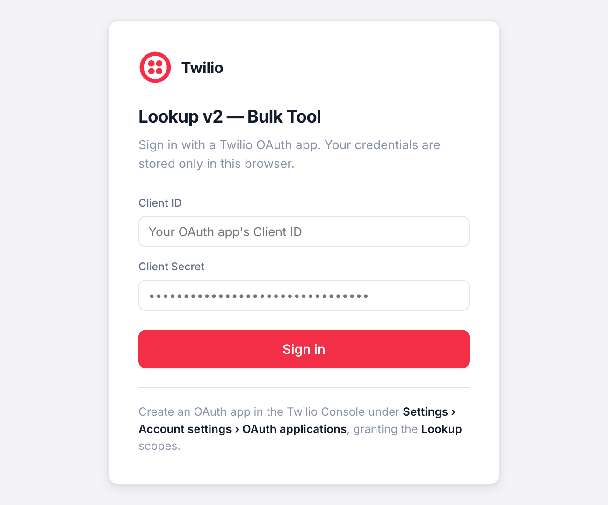

# Twilio Lookup API UI

A browser-based tool for running bulk [Twilio Lookup v2](https://www.twilio.com/docs/lookup/v2-api) queries, deployed on [Twilio Serverless](https://www.twilio.com/docs/serverless/toolkit). Paste phone numbers or upload a CSV, select data packages, and export results to CSV.

Users sign in with their own [Twilio OAuth app](https://www.twilio.com/docs/iam/oauth-apps/overview) credentials from a login screen — there is no server-side `.env` to manage and no infrastructure to run.

<p align="center">
  
</p>

**Supported data packages:** `caller_name`, `sim_swap`, `call_forwarding`, `line_status`, `line_type_intelligence`, `identity_match`, `reassigned_number`, `sms_pumping_risk`, `validation`

> [!WARNING]
> **Every data package is billed per phone number looked up.** This is a *bulk* tool — 5,000 numbers with 3 packages selected is 15,000 billable Lookup requests. Check [Lookup pricing](https://www.twilio.com/en-us/lookup/pricing) and test with a short list first.

> Not an official Twilio product. Unaffiliated with, and unsupported by, Twilio Inc.

---

## Prerequisites

- [Twilio CLI](https://www.twilio.com/docs/twilio-cli/quickstart), installed and authenticated
- Serverless plugin: `twilio plugins:install @twilio-labs/plugin-serverless`
- Node.js 18+
- A Twilio account with Lookup access, and an OAuth app to sign in with ([setup below](#set-up-a-twilio-oauth-app))

## Deploy

```bash
git clone https://github.com/abelzx/twilio-lookup-api-ui.git
cd twilio-lookup-api-ui
npm install
npm run deploy
```

The CLI prints the deployed URL, e.g. `https://twilio-lookup-serverless-XXXX.twil.io/index.html`.

| Command | What it does |
|---|---|
| `npm run deploy` | Deploy (or re-deploy) to Twilio Serverless |
| `npm run dev` | Run locally at `http://localhost:3000/index.html` |
| `npm run remove -- --sid ZS…` | Tear down a deployed service |

Re-running `npm run deploy` updates the existing service in place — the service SID is cached in the local, git-ignored `.twiliodeployinfo`.

The Serverless Toolkit has no delete command, so `npm run remove` wraps the REST API and needs an explicit service SID (`npm run remove -- --sid ZS…`, or a service's unique name). `twilio serverless:list services` will show you the SIDs.

> [!TIP]
> `.twiliodeployinfo` caches the service SID per **account**, not per service name — so `--service-name` alone will *not* protect an existing deployment. To deploy a throwaway copy side by side, move `.twiliodeployinfo` aside first, deploy with `--service-name some-other-name`, then restore it so `npm run deploy` keeps targeting the original service.

### Node.js runtime

The Functions runtime is pinned to **`node24`** (Active LTS) in `.twilioserverlessrc`:

```json
{ "runtime": "node24" }
```

Pinning matters: with no `runtime` key, the Serverless API reuses the runtime of your *last successful build*, so a deploy from a fresh clone is not reproducible. To validate a runtime change in isolation before it reaches your main environment:

```bash
npm run deploy:verify-24     # deploys to a throwaway `verify-24` environment
```

`@twilio/runtime-handler` is intentionally **not** listed in `package.json` — the platform injects and auto-upgrades it at build time. node24 requires ≥ 2.1.2, which isn't published on npm (latest public is 2.1.0), so it can only come from the platform. If a node24 build ever fails on the handler version, fall back to `"runtime": "node22"` (Maintenance LTS).

The Twilio CLI itself requires Node.js 20+ locally; the deployed runtime is independent of your local version.

---

## Set up a Twilio OAuth app

Sign-in uses an account-level OAuth app, so each user authenticates with a Client ID and Client Secret scoped to Lookup rather than with your account's Auth Token.

1. In the [Twilio Console](https://console.twilio.com), go to **Settings › Account settings › OAuth applications**.
2. Click **Create an OAuth app**.
3. On **Application details**, give it a name (e.g. `Lookup Bulk Tool`). Click **Next**.
4. On **Scopes & permissions**:
   - Set **Token expiration time** — between 1 minute and 30 days, default 1 hour. The default is fine: this tool fetches a token per request batch and never stores one.
   - Select the **Lookup** scopes. Grant nothing else — no other part of this app calls another Twilio API.
5. On **Copy secret**, copy the **Client ID** and **Client Secret**. **The secret is shown only once.**
6. Tick **Got it!** and click **Finish**.

Open the deployed URL and paste the Client ID and Client Secret into the login screen.

To rotate the secret later, open the app and use **Credentials › Rotate secret**. You can set a grace period of 0–30 days during which the old secret keeps working, so you can roll it out without locking anyone out.

> [!NOTE]
> Account-level OAuth apps support only the **Client Credentials** grant — [Authorization Code is organization-level only](https://www.twilio.com/docs/iam/oauth-apps/account-oauth-apps), so there is no browser consent-redirect flow available here. Users paste credentials, exactly as they did before; what changes is *what* those credentials can do.

### How authentication works

1. The login screen collects the OAuth app's **Client ID** and **Client Secret**.
2. `POST /verify` exchanges them for an access token at `https://oauth.twilio.com/v2/token`. A token coming back proves the credentials are valid. This costs nothing and does not depend on which scopes were granted.
3. Credentials are stored in the browser's `sessionStorage` and sent in the body of each `POST /lookup` request.
4. `/lookup` builds a Twilio client via the SDK's `ClientCredentialProviderBuilder`, fetches **one** access token per request, and reuses it for every number in that batch. Tokens live only for the duration of the request.

Nothing is persisted server-side: no `.env`, no database, and Twilio Serverless does not log request bodies.

> [!IMPORTANT]
> **Scope the OAuth app to Lookup and nothing else.** The Client Secret lives in `sessionStorage` for the browser session, so any XSS on the deployed page could read it — the same exposure the Auth Token had. The gain is blast radius: a leaked Lookup-scoped Client Secret cannot send messages, buy numbers, or read your call logs, and it can be rotated with a grace period without touching your account's master credential.
>
> Two more things to know before sharing the URL:
> - **The deployed functions are public.** Anyone with the URL can use the tool, but only with OAuth credentials they already hold — the app holds no credentials of its own, so it cannot be used to spend *your* balance.
> - **Credentials transit your deployed service.** Teammates you share the URL with are trusting your deployment, not just Twilio.

---

## Usage

1. **Enter numbers** — paste E.164 numbers (e.g. `+14155552671`) into the text box, one per line or comma-separated, or upload a CSV and specify which column holds the phone numbers.
2. **Select data packages** — check the packages you want. Each adds to your Lookup cost; `line_type_intelligence`, `line_status`, and `sms_pumping_risk` are checked by default.
3. **Run** — click **Run Lookup**. A progress bar tracks batches for large lists. You can cancel mid-run and export partial results.
4. **Export** — click **Export CSV** to download a flat CSV with one row per number and all response fields as columns.

### Advanced options

| Option | Default | Description |
|---|---|---|
| Concurrency | 5 | Parallel Lookup calls per request (max 7) |
| Batch size | 30 | Numbers per HTTP request (max 2000) |
| Parallel batches | 2 | HTTP requests in flight at once |
| Skip records | 0 | Skip the first N numbers (useful to resume a partial run) |
| Country code | — | Default country for non-E.164 input |
| Last verified date | — | Cutoff for `reassigned_number` |
| Partner sub-ID | — | Sub-account identifier passed to Lookup |

Concurrency is capped at 7 per request because Twilio Functions have a [10-second execution timeout](https://www.twilio.com/docs/serverless/functions-assets/functions/execution-limits) — keep batches small enough to finish inside it.

### Identity Match

Expand **Identity Match fields** to supply name and address data for the `identity_match` package. All fields are optional — only non-empty values are sent.

---

## Project structure

```
twilio-lookup-api-ui/
├── .twilioserverlessrc  # Twilio Serverless config (functions/ + assets/ folders)
├── functions/
│   ├── lookup.js        # POST /lookup — runs Lookup v2 queries
│   └── verify.js        # POST /verify — validates OAuth credentials
└── assets/              # Static frontend, served as Twilio Assets
    ├── index.html
    ├── app.js
    └── styles.css
```

See [`docs/design.md`](docs/design.md) for the endpoint contracts, batching model, and the trade-offs behind the concurrency cap.

## Contributing

`npm run dev` serves the app at `http://localhost:3000/index.html` with the same login flow as production. CI runs a syntax check and a production `npm audit` on Node 22 and 24, and fails the build if credentials or the deploy cache are ever committed.

## License

[MIT](LICENSE) © Abel Ng
